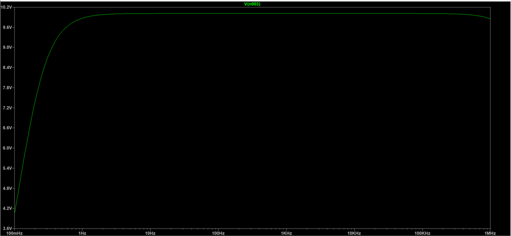

# Audio-Amplifier-with-Digital-Predistortion
 Designed an audio amplifier system with digital predistortion(DPD), where the DPD system introduces inverse nonlinear distortion to the input audio signal, thereby offsetting the distortion of the signal in the nonlinear amplifier, reducing the distortion rate and improving the overall audio fidelity.

# Overview
The research first establishes corresponding coefficient models for the original audio amplifier and the DPD system. According to the logic-mathematical relationship between the input signal and the system coefficient model, the digital predistortion technology is explored. In order to solve the problem of high-frequency distortion, up-sampling
processing is used to increase the sampling rate of the input audio signal. This step significantly improves the accuracy of the predistortion and improves the quality of the output signal. The audio amplifier circuit is designed with a Class A amplifier circuit. The software simulation test is carried out using MATLAB and LTspice software to verify the proposed DPD system and class A amplifier circuit. Experimental results show that the sixth-order DPD system has a better predistortion effect than the initial fourth-order DPD coefficient model. The designed class A amplifier circuit has a stable voltage gain.

The block diagram of an audio amplifier system with DPD is shown below:

 

# Results

1. The circuit diagram of the original audio amplifier in LTspice:

The simulation result of the amplifier circuit in LTspice in shown below:

According to the above results, the voltage amplification gain of the amplifier circuit is about 10, and the voltage gain curve shows the characteristic of saturation gain at a very low frequency. From 100mHz to 1Hz, the voltage gain continues to increase with a large slope. Near the signal frequency of 1Hz, the voltage gain has almost reached the saturation gain value. And in the subsequent continuously increasing signal frequency, the almost stable voltage gain of about 10 is consistently maintained. The above simulation results show that this class A audio amplifier circuit can well implement the amplification effect of the input signal, and can maintain the set voltage amplification gain of 10 in almost the entire frequency range. The design of the audio amplifier circuit in this project is successfully implemented at the software level 

2. The time domain check and frequency domain check between original audio amplifier and amplifier with DPD in system pretest:

As can be seen from the figure above, the audio amplifier system with DPD is consistent with the original amplifier in the amplitude of the linear component, that is, the first signal component on both sides of the middle signal column. In the DC component (middle), square component, and cubic component, the output of the audio amplifier system with DPD has a very significant reduction, and the DPD system also produces some by products, but these by-products are very low in the output signal and can be ignored. Therefore, an audio amplifier system with DPD has a significant improvement over the original amplifier in terms of nonlinear distortion.
3. The frequency spectra of the original input audio signal, the output signal of the original amplifier and the output signal of the audio amplifier system with DPD in real audio signal testing:

According to the figure, it can be seen that after the upsampled real audio signal is processed by the audio amplifier system with DPD, there is almost no signal added to the frequency spectrum, which is highly consistent with the original input audio frequency spectrum, and the amplitude has been amplified. However, the output signal of the original amplifier has a large number of newly added frequency signals, and the content of the signal components of these new frequencies cannot be ignored. These new signals are the nonlinear distortion obtained after the input signal is processed by the original amplifier. 
