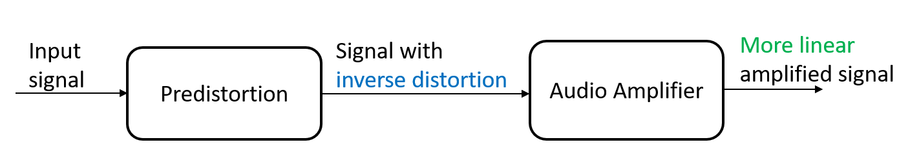
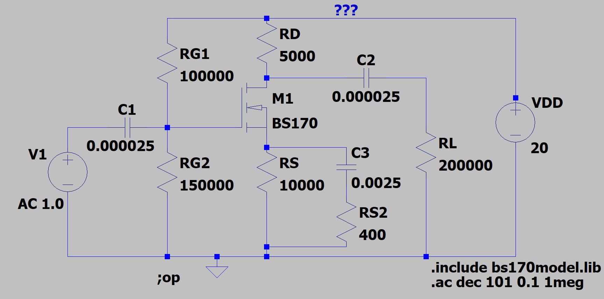
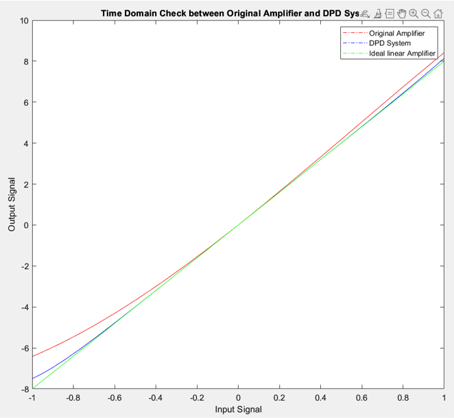
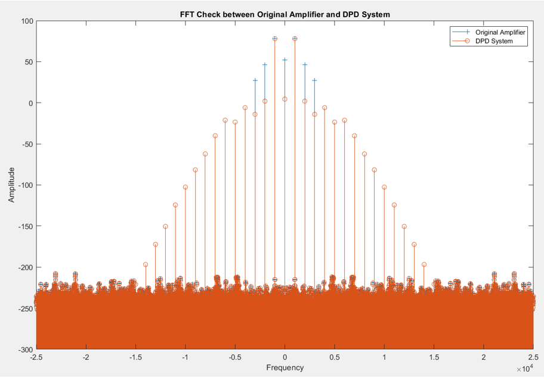
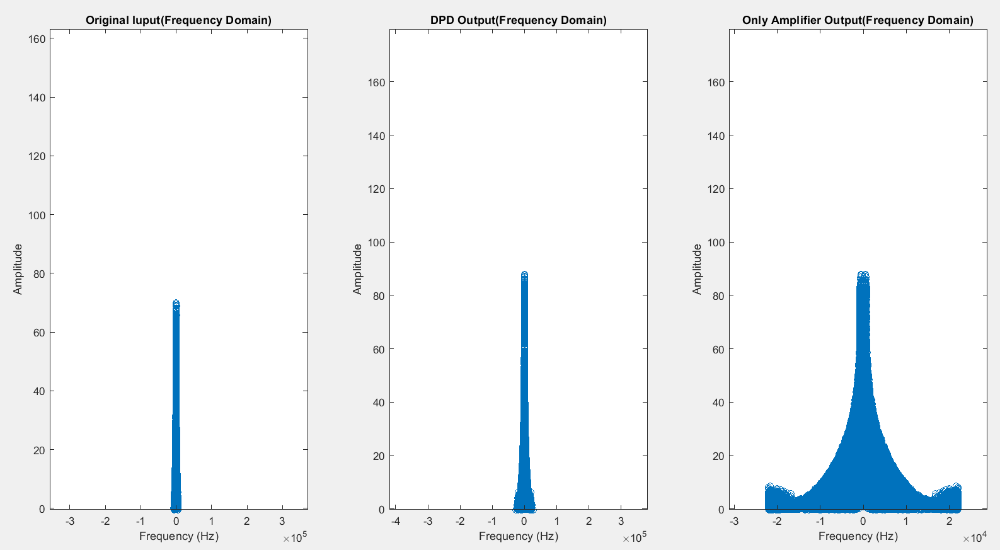

# Audio-Amplifier-with-Digital-Predistortion
 Designed an audio amplifier system with digital predistortion(DPD), where the DPD system introduces inverse nonlinear distortion to the input audio signal, thereby offsetting the distortion of the signal in the nonlinear amplifier, reducing the distortion rate and improving the overall audio fidelity.

# Overview
The research first establishes corresponding coefficient models for the original audio amplifier and the DPD system. According to the logic-mathematical relationship between the input signal and the system coefficient model, the digital predistortion technology is explored. In order to solve the problem of high-frequency distortion, up-sampling
processing is used to increase the sampling rate of the input audio signal. This step significantly improves the accuracy of the predistortion and improves the quality of the output signal. The audio amplifier circuit is designed with a Class A amplifier circuit. The software simulation test is carried out using MATLAB and LTspice software to verify the proposed DPD system and class A amplifier circuit. Experimental results show that the sixth-order DPD system has a better predistortion effect than the initial fourth-order DPD coefficient model. The designed class A amplifier circuit has a stable voltage gain.

The block diagram of an audio amplifier system with DPD is shown below:

 

# Some Result Pictures

1. The circuit diagram of the original audio amplifier in LTspice:

2. The time domain check and frequency domain check between original audio amplifier and amplifier with DPD in system pretest:

3. The frequency spectra of the original input audio signal, the output signal of the original amplifier and the output signal of the audio amplifier system with DPD in real audio signal testing:

According to the figure, it can be seen that after the upsampled real audio signal is processed by the audio amplifier system with DPD, there is almost no signal added to the frequency spectrum, which is highly consistent with the original input audio frequency spectrum, and the amplitude has been amplified. However, the output signal of the original amplifier has a large number of newly added frequency signals, and the content of the signal components of these new frequencies cannot be ignored. These new signals are the nonlinear distortion obtained after the input signal is processed by the original amplifier. 
